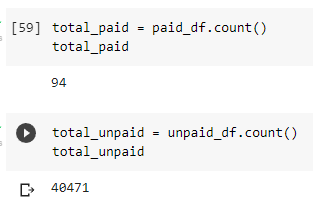
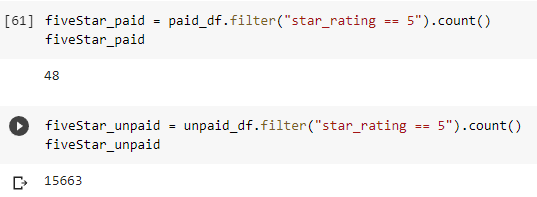
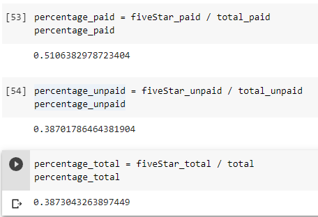

# Amazon Vine Analysis
Comparing reviews of video games from Vine users and Non-Vine users

## Overview
The purpose of this analysis is to compare the reviews of video games from Vine users and users from other sources to determine if there was a bias toward Vine users.

## Results
After filtering the results to only include 20 or more helpful votes, the total number of Vine reviews were 94 and the total number of other reviews were 40,471.

Of those, the total number of 5-star Vine reviews were 48 and the total number of 5-star reviews from elsewhere were 15,663.

The percentage of Vine reviews that were 5 stars was 51% and the percentage of other reviews that were 5 stars was 39%.

## Summary
There does appear to be a positivity bias among Vine users as their percentage of 5-star reviews was much higher than the percentage among all of the reviews, which is represented as "percentage_total" in the screenshot above. The percentage of 5-star reviews among non-Vine users was approximately the same as the total percentage. It may also be useful to filter for verified purchases in order to ensure the accuracy of the reviews.